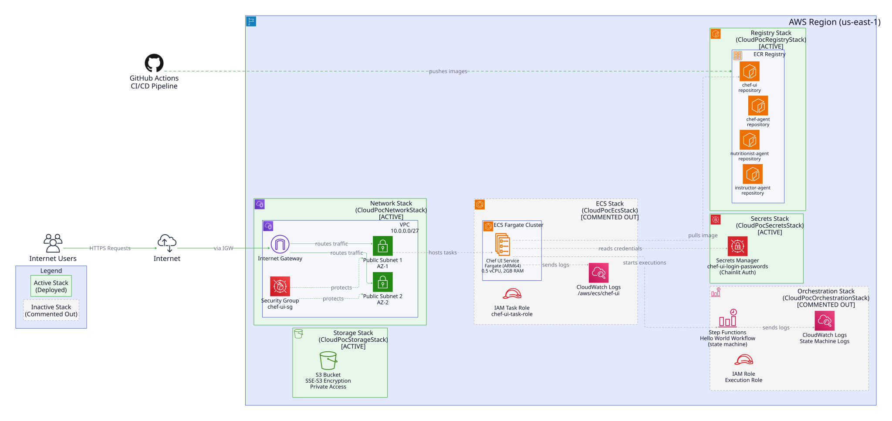

# Cloud POC - AWS CDK Architecture Documentation

## Executive Summary

This document describes the AWS infrastructure defined using AWS Cloud Development Kit (CDK) for the Cloud POC project. The infrastructure is organized into multiple CDK stacks, each responsible for a specific aspect of the overall architecture. The project includes both CDK-managed infrastructure and SAM-deployed Lambda functions that work together to provide a serverless Chef assistant API.


## System Context

The Cloud POC infrastructure provisions a serverless application environment on AWS, including networking, storage, container registry, secrets management, Step Functions orchestration, API Gateway, and AWS Lambda functions. The architecture follows AWS best practices for security, scalability, and operational excellence.



## Architecture Overview

The infrastructure is organized into seven CDK stacks and two SAM-deployed Lambda functions:

### Active CDK Stacks (Currently Deployed)

1. **CloudPocNetworkStack**: Provides VPC networking infrastructure
2. **CloudPocStorageStack**: Provisions encrypted S3 bucket storage
3. **CloudPocClusterStack**: Creates ECS Fargate cluster (infrastructure ready)
4. **CloudPocRegistryStack**: Creates ECR repository for container images
5. **CloudPocSecretsStack**: Manages application secrets via AWS Secrets Manager
6. **CloudPocOrchestrationStack**: Provisions Step Functions state machine for workflow orchestration
7. **CloudPocApiStack**: Provides API Gateway for HTTP access to Step Functions

### SAM-Deployed Lambda Functions

1. **ChefApp Lambda**: Mock chef agent that provides dish suggestions
2. **OFFAPI Lambda**: Invokes Open Food Facts API to retrieve nutritional information

## Component Architecture

### 1. Network Stack (CloudPocNetworkStack) - **ACTIVE**

**Purpose**: Provides the foundational networking infrastructure for the application.

**Components**:
- **VPC**: 10.0.0.0/27 CIDR block (smallest AWS-allowed VPC, 32 IPs)
- **Public Subnets**: Two /28 subnets across two Availability Zones (16 IPs each)
  - Subnet 1: AZ-1
  - Subnet 2: AZ-2
- **Internet Gateway**: Enables internet connectivity for public subnets
- **Security Group**: `chef-ui-sg` - Controls inbound/outbound traffic

**Design Decisions**:
- **Smallest possible VPC** (/27): Optimized for cost and simplicity; sufficient for POC workload
- **Public subnets only**: No NAT Gateway (~$35/month cost savings) since the application is internet-facing
- **Multi-AZ deployment**: Two availability zones for high availability
- **Internet Gateway**: Automatically provisioned by CDK for public subnet internet access
- **Security rules driven by configuration**: All firewall rules defined in `network_config.py`

**Key Configuration** (from `config/network_config.py`):
```python
vpc_cidr: "10.0.0.0/27"
max_azs: 2
nat_gateways: 0  # No NAT Gateway needed
```

### 2. Storage Stack (CloudPocStorageStack) - **ACTIVE**

**Purpose**: Provides secure, encrypted object storage for the application.

**Components**:
- **S3 Bucket**: Private, encrypted bucket with SSE-S3 (AES-256) encryption

**Design Decisions**:
- **No explicit bucket name**: CDK generates unique name to prevent collisions
- **SSE-S3 encryption**: AWS-managed keys for data at rest
- **Private access**: BlockPublicAccess.BLOCK_ALL + BUCKET_OWNER_ENFORCED
- **SSL enforcement**: Bucket policy denies non-HTTPS requests (S3.5 AWS security best practice)
- **No versioning**: Disabled per requirements
- **No lifecycle rules**: Intentionally omitted

**Security Features**:
- Encryption at rest (SSE-S3)
- Block all public access
- Enforce SSL/TLS for all requests
- Bucket owner enforced object ownership

### 3. Cluster Stack (CloudPocClusterStack) - **ACTIVE**

**Purpose**: Provides ECS Fargate cluster infrastructure (ready for future ECS services).

**Components**:
- **ECS Fargate Cluster**: Serverless container orchestration platform

**Design Decisions**:
- **Fargate serverless**: No EC2 instances to manage
- **Infrastructure ready**: Cluster created but no services deployed yet
- **Future ready**: Prepared for Chef UI ECS service deployment

### 4. Registry Stack (CloudPocRegistryStack) - **ACTIVE**

**Purpose**: Hosts Docker container images for the application components.

**Components**:
- **ECR Registry** containing one repository:
  - `chef-ui`: Chef UI Chainlit application

**Design Decisions**:
- **Explicit repository name**: Required for IAM policies and resource references
- **Tag immutability**: Prevents overwrite of existing tags (security best practice)
- **Image scan on push**: Automatic CVE scanning at no extra cost
- **Lifecycle policy**: Untagged images expire after 1 day (cleanup)
- **RETAIN removal policy**: Prevents accidental image loss on stack deletion

**Security Features**:
- Private repository (no public access)
- Image scanning on push
- Tag immutability enabled
- Automatic lifecycle management

### 5. Secrets Stack (CloudPocSecretsStack) - **ACTIVE**

**Purpose**: Manages application credentials and secrets securely.

**Components**:
- **Secrets Manager Secret**: `chef-ui-login-passwords` for Chainlit authentication
  - Stores: CHAINLIT_AUTH_SECRET, CHEF_UI_USER, CHEF_UI_PASSWORD

**Design Decisions**:
- **Separate stack**: Secrets have RETAIN policy to prevent accidental deletion
- **Resource policy**: Grants appropriate read access to services
- **Manual population**: Secret created empty; values populated post-deployment
- **RETAIN removal policy**: Credentials never destroyed on stack teardown

**Security Features**:
- AWS Secrets Manager encryption
- Resource-based access policy
- Retain on deletion

### 6. Orchestration Stack (CloudPocOrchestrationStack) - **ACTIVE**

**Purpose**: Provides workflow orchestration using AWS Step Functions that coordinates Lambda function invocations.

**Components**:
- **Step Functions State Machine**: "HelloWorldStateMachine" workflow
  - Invokes ChefApp Lambda function first
  - Conditionally checks response for "sugerencias" field
  - If present: Returns suggestions directly
  - If not present: Invokes OFFAPI Lambda function for nutritional data
- **CloudWatch Log Group**: State machine execution logs (7-day retention)
- **IAM Execution Role**: Permissions for CloudWatch Logs, X-Ray, and Lambda invocation

**Workflow Logic**:
1. **InvokeChefLambda**: Calls ChefApp Lambda with user input
2. **CheckSuggestions**: Validates if response contains "sugerencias" field
3. **ReturnSuggestions**: Returns Chef suggestions if present (success path)
4. **InvokeNextLambda**: Calls OFFAPI Lambda with Chef response (alternative path)
5. **ReturnFinalResult**: Returns nutritional information from OFFAPI

**Design Decisions**:
- **ASL JSON definition**: Workflow defined in `config/step_functions/hello_world_workflow.asl.json`
- **Dynamic ARN substitution**: Lambda ARNs injected at deployment via `definition_substitutions`
- **X-Ray tracing**: Enabled for distributed tracing
- **CloudWatch logging**: ALL level with execution data included
- **Retry logic**: 3 attempts with exponential backoff for Lambda invocations
- **Error handling**: Catch blocks for graceful failure handling

**Lambda Function Integration**:
- **ChefApp Lambda**: `CloudCorePocChefAppStack-ChefApp`
- **OFFAPI Lambda**: `CloudPocOpenFoodFactsAPIStack-OFFAPICaller`

**Current Status**: Fully active and integrated with API Gateway

### 7. API Stack (CloudPocApiStack) - **ACTIVE**

**Purpose**: Provides public REST API for invoking the Step Functions workflow via HTTP.

**Components**:
- **REST API Gateway**: `CloudPocChefApi`
  - **Endpoint**: `/chef` (POST method)
  - **Stage**: `prod`
  - **Authentication**: API Key required
- **API Key**: `CloudPocChefApiKey`
- **Usage Plan**: Rate limiting and throttling configuration
- **IAM Role**: Grants API Gateway permission to start Step Functions executions
- **CloudWatch Log Group**: `/aws/apigateway/CloudPocChefApi` (7-day retention)

**Design Decisions**:
- **REST API**: Classic REST API (not HTTP API) for Step Functions integration features
- **API Key authentication**: Simple authentication mechanism for POC
- **Direct Step Functions integration**: Uses AWS Service integration (no Lambda proxy)
- **X-Ray tracing enabled**: Full distributed tracing across API → Step Functions → Lambda
- **CloudWatch logging**: INFO level with access logs in JSON format
- **Throttling**: 10 requests/second rate limit, 20 burst limit
- **CORS enabled**: Allow requests from all origins for development flexibility

**Integration Details**:
- **Request transformation**: Wraps incoming JSON payload for Step Functions
- **Response transformation**: Returns execution ARN and start date
- **Error handling**: Maps 4xx and 5xx errors with appropriate messages

**Security Features**:
- API Key required for all requests
- Usage plan with rate limiting
- CloudWatch role automatically created
- IAM least-privilege for Step Functions invocation

**Current Status**: Fully active and publicly accessible

## SAM-Deployed Lambda Functions

### ChefApp Lambda (SAM Stack: AgentCorePocChefAppStack)

**Purpose**: Mock chef agent that provides dish suggestions based on user input.

**Configuration**:
- **Runtime**: Python 3.12 (ARM64 architecture)
- **Memory**: 256 MB
- **Timeout**: 30 seconds
- **Function Name**: `CloudCorePocChefAppStack-ChefApp`

**Functionality**:
- Accepts input with "plato" field
- Returns three dish suggestions
- Response includes "sugerencias" array

**Input Format**:
```json
{
  "input": "Sugiereme un plato para cenar esta noche, por favor..."
}
```

**Output Format**:
```json
{
  "statusCode": 200,
  "body": {
    "plato": {...},
    "sugerencias": [
      "Ensalada César con pollo a la parrilla",
      "Pasta al pesto con tomates cherry",
      "Salmón al horno con espárragos"
    ]
  }
}
```

**Resources**:
- Lambda Layer: `chefapp-common-dependencies` (aws-lambda-powertools, pydantic)
- IAM Role: With CloudWatch Logs and X-Ray permissions
- CloudWatch Log Group: 7-day retention

### OFFAPI Lambda (SAM Stack: AgentCorePocOpenFoodFactsAPIStack)

**Purpose**: Queries Open Food Facts API to retrieve nutritional information for food products.

**Configuration**:
- **Runtime**: Python 3.12 (ARM64 architecture)
- **Memory**: 256 MB
- **Timeout**: 30 seconds
- **Function Name**: `CloudPocOpenFoodFactsAPIStack-OFFAPICaller`

**Functionality**:
- Accepts product names list and limit parameter
- Calls Open Food Facts API (staging environment)
- Returns nutritional data including calories, fat, sugars, etc.

**Input Format** (from Step Functions):
```json
{
  "product_names": ["leche"],
  "limit": 3
}
```

**Output Format**:
```json
{
  "statusCode": 200,
  "body": {
    "leche": {
      "products": [
        {
          "name": "Leche Entera",
          "brand": "Marca",
          "calories_100g": 65,
          "nutriments": {...}
        }
      ]
    }
  }
}
```

**Resources**:
- Lambda Layer: `common-dependencies` (requests, pydantic, aws-lambda-powertools)
- IAM Role: With CloudWatch Logs and X-Ray permissions
- CloudWatch Log Group: 7-day retention
- Environment Variables: OFF_PROD_URL, OFF_STAGING_URL

## Deployment Architecture

### Current Active Infrastructure

The currently active infrastructure consists of:

```
Internet Users
    ↓
API Gateway (/chef endpoint)
    ↓ (requires API Key)
Step Functions State Machine
    ↓
┌─────────────────────┬─────────────────────┐
│                     │                     │
│   ChefApp Lambda    │   OFFAPI Lambda     │
│   (provides dishes) │   (nutritional data)│
└─────────────────────┴─────────────────────┘

Supporting Infrastructure:
├─ VPC (10.0.0.0/27)
│  ├─ Internet Gateway
│  ├─ Public Subnet 1 (AZ-1)
│  ├─ Public Subnet 2 (AZ-2)
│  └─ Security Group
├─ S3 Bucket (encrypted, private)
├─ ECS Cluster (ready, no services)
├─ ECR Registry
│  └─ chef-ui repository
└─ Secrets Manager
   └─ chef-ui-login-passwords
```

### API Request Flow

1. **User Request**: Client sends POST request to API Gateway `/chef` endpoint with API key
2. **API Gateway**: Validates API key, starts Step Functions execution
3. **Step Functions**: Orchestrates workflow:
   - Invokes ChefApp Lambda with user input
   - Checks response for "sugerencias" field
   - If suggestions exist: Returns them
   - If not: Invokes OFFAPI Lambda for nutritional data
4. **Response**: API Gateway returns execution details to client

### Data Flow

**Scenario 1: Chef Suggestions Found**
```
User → API Gateway → Step Functions → ChefApp Lambda → Step Functions → API Gateway → User
                                       (returns suggestions)
```

**Scenario 2: Nutritional Data Needed**
```
User → API Gateway → Step Functions → ChefApp Lambda → Step Functions → OFFAPI Lambda → Step Functions → API Gateway → User
                                       (no suggestions)      (calls Open Food Facts API)
```

## Deployment Instructions

### Prerequisites

1. **AWS CLI** configured with appropriate credentials
2. **AWS CDK** installed (`npm install -g aws-cdk`)
3. **AWS SAM CLI** installed
4. **Python 3.12+** for Lambda development
5. **Docker** for SAM builds

### Deployment Order

#### Phase 1: Deploy Lambda Functions (SAM)

1. **Deploy ChefApp Lambda**:
```bash
cd lambdas/ChefApp
sam build
sam deploy --guided
# Stack name: AgentCorePocChefAppStack
```

2. **Deploy OFFAPI Lambda**:
```bash
cd lambdas/OFFAPI
sam build
sam deploy --guided
# Stack name: AgentCorePocOpenFoodFactsAPIStack
```

#### Phase 2: Deploy CDK Infrastructure

Update Lambda function names in `aws-infra/config/orchestration_config.py` if needed, then:

```bash
cd aws-infra
cdk bootstrap  # First time only
cdk deploy --all
```

This deploys all active stacks:
- CloudPocNetworkStack
- CloudPocStorageStack
- CloudPocClusterStack
- CloudPocRegistryStack
- CloudPocSecretsStack
- CloudPocOrchestrationStack (references Lambda ARNs)
- CloudPocApiStack

#### Phase 3: Retrieve API Key

```bash
aws apigateway get-api-keys --include-values \
  --query "items[?name=='CloudPocChefApiKey'].value" --output text
```

### Testing the API

```bash
curl -X POST https://<api-id>.execute-api.<region>.amazonaws.com/prod/chef \
  -H "x-api-key: <your-api-key>" \
  -H "Content-Type: application/json" \
  -d '{"input": "Sugiereme un plato para cenar esta noche"}'
```

Response:
```json
{
  "executionArn": "arn:aws:states:...",
  "startDate": "2026-05-08T..."
}
```

## Non-Functional Requirements Analysis

### Scalability

**Current Architecture**:
- **API Gateway**: Automatically scales to handle request volume (throttled at 10 req/s)
- **Step Functions**: Scales automatically, supports up to 5,000 concurrent executions per account
- **Lambda Functions**: Auto-scales to handle concurrent invocations (default: 1,000 concurrent)
- **VPC**: Sufficient IP space for current workload; can be expanded if needed

**Scalability Enhancements (Future Options)**:
- Deploy container-based services if UI frontend needed
- Add Application Load Balancer for traffic distribution
- Implement auto-scaling policies for compute resources
- Use CloudFront CDN for global distribution

### Performance

**Latency Characteristics**:
- API Gateway: ~50ms overhead
- Step Functions: ~100ms per state transition
- ChefApp Lambda: ~200ms cold start, ~50ms warm
- OFFAPI Lambda: ~300ms cold start + external API call time (~500-1000ms)
- Total end-to-end: 1-2 seconds typical

**Optimizations**:
- ARM64 architecture for Lambda (faster execution)
- Lambda layers for shared dependencies
- Provisioned concurrency can eliminate cold starts (additional cost)

### Security

**Implemented Security Controls**:
- **API Authentication**: API Key required for all API Gateway requests
- **Network Isolation**: VPC with security groups
- **Encryption at Rest**: S3 bucket with SSE-S3, Secrets Manager
- **Encryption in Transit**: HTTPS enforced on API Gateway and S3
- **Least Privilege IAM**: Each service has minimal required permissions
- **X-Ray Tracing**: Enabled for security audit trails
- **CloudWatch Logging**: All services log to CloudWatch for monitoring
- **ECR Image Scanning**: Automatic vulnerability scanning on push
- **Private ECR**: Container images not publicly accessible

**Additional Security Recommendations**:
- Implement AWS WAF on API Gateway
- Enable GuardDuty for threat detection
- Use AWS Secrets Manager rotation for credentials
- Implement VPC endpoints for private AWS service access
- Enable CloudTrail for API audit logging

### Reliability

**High Availability**:
- Multi-AZ VPC deployment
- API Gateway: 99.95% SLA
- Lambda: 99.95% SLA
- Step Functions: 99.9% SLA
- S3: 99.99% availability

**Fault Tolerance**:
- Lambda retry logic: 3 attempts with exponential backoff
- Step Functions error handling with catch blocks
- API Gateway integration error mapping

**Monitoring & Observability**:
- X-Ray distributed tracing
- CloudWatch Logs (7-day retention)
- CloudWatch Metrics for all services
- Step Functions execution history

### Maintainability

**Infrastructure as Code**:
- CDK for infrastructure (TypeScript-like Python)
- SAM for Lambda functions
- Configuration externalized in config files
- Version controlled in Git

**Operational Excellence**:
- Separate stacks for isolation
- Stack outputs for easy reference
- Descriptive resource names
- Comprehensive documentation

### Cost Efficiency

**Monthly Cost Estimate** (assuming moderate usage):

| Service | Configuration | Estimated Cost |
|---------|--------------|----------------|
| API Gateway | 1M requests/month | $3.50 |
| Step Functions | 10K executions/month | $0.25 |
| Lambda (ChefApp) | 10K invocations, 256MB, 200ms avg | $0.40 |
| Lambda (OFFAPI) | 5K invocations, 256MB, 500ms avg | $0.25 |
| VPC | No NAT Gateway | $0.00 |
| S3 | 10GB storage, 1K requests | $0.23 |
| ECR | 5GB storage | $0.50 |
| CloudWatch Logs | 1GB ingestion, 7-day retention | $0.50 |
| Secrets Manager | 1 secret | $0.40 |
| **Total** | | **~$6.00/month** |

**Cost Optimization**:
- No NAT Gateway saves ~$35/month
- ARM64 Lambda ~20% cheaper than x86
- 7-day log retention reduces storage costs
- Serverless architecture: pay only for usage

## Risks and Mitigations

| Risk | Impact | Mitigation |
|------|--------|------------|
| API Key exposure | High | Rotate keys regularly, implement AWS WAF, consider Cognito |
| Lambda cold starts | Medium | Use provisioned concurrency for critical paths |
| Step Functions throttling | Medium | Request service quota increase if needed |
| External API dependency (Open Food Facts) | Medium | Implement caching, fallback responses |
| No automated backups | Low | S3 versioning can be enabled if needed |
| Single region deployment | Medium | Multi-region can be added for DR |

## Technology Stack

**AWS Services**:
- API Gateway (REST API)
- AWS Step Functions (Standard Workflows)
- AWS Lambda (Python 3.12, ARM64)
- VPC, Internet Gateway, Security Groups
- S3 (SSE-S3 encryption)
- ECR (container registry)
- ECS Fargate (infrastructure ready)
- Secrets Manager
- CloudWatch (Logs, Metrics, X-Ray)

**Development Tools**:
- AWS CDK (Python)
- AWS SAM
- Python 3.12 (aws-lambda-powertools, pydantic, requests)
- Docker
- Git

## Next Steps

1. **Implement Monitoring and Alerting**: Create dashboards and configure alarms
2. **Add Caching**: Implement ElastiCache or DynamoDB for API response caching
3. **Implement Enhanced Authentication**: Replace API Key with Amazon Cognito
4. **Add CDN**: Deploy CloudFront for global distribution and improved performance
5. **Monitoring Dashboard**: Create CloudWatch dashboard for metrics visualization
6. **CI/CD Pipeline**: Implement GitHub Actions for automated deployments
7. **Multi-Region**: Extend to multiple AWS regions for disaster recovery
8. **Load Testing**: Perform load testing to validate scalability assumptions

## Data Flow

### Current State (Active Stacks Only)

1. **CI/CD Pipeline** (GitHub Actions):
   - Builds Docker images
   - Pushes images to ECR repository
   - Images are scanned for vulnerabilities on push

2. **Storage**:
   - S3 bucket available for application data storage
   - All access must use SSL/TLS

## Phased Development

### Current State: Serverless API Architecture (ACTIVE)

**Objective**: Serverless API-driven architecture with workflow orchestration.

**Deployed Components**:
- ✅ VPC with networking (NetworkStack)
- ✅ S3 storage (StorageStack)
- ✅ ECR repository (RegistryStack)
- ✅ Secrets management (SecretsStack)
- ✅ ECS Cluster infrastructure (ClusterStack - ready for future use)
- ✅ Step Functions workflow orchestration (OrchestrationStack)
- ✅ API Gateway with REST endpoint (ApiStack)
- ✅ Lambda functions for business logic (SAM-deployed)

**Status**: Fully deployed and operational

**Architecture Pattern**: API Gateway → Step Functions → Lambda → External APIs

**Benefits**:
- Fully serverless, pay-per-use model
- No infrastructure management required
- Automatic scaling based on demand
- Low operational overhead
- Cost-optimized (~$6/month)

### Future Enhancement Options

**Option 1: Add Container-Based UI**:
- Deploy Chef UI as ECS Fargate service
- Connect UI to existing Step Functions workflow
- Estimated additional cost: ~$10-15/month

**Option 2: Enhanced Observability**:
- Add CloudWatch dashboards
- Configure CloudWatch alarms
- Implement SNS notifications
- Minimal cost increase

**Option 3: High Availability & Performance**:
- Add CloudFront CDN
- Implement caching layer
- Add Application Load Balancer (if ECS deployed)
- Estimated additional cost: ~$20-30/month

## Risks and Mitigations

### Risk 1: API Key Exposure

**Risk Level**: High  
**Impact**: Unauthorized API access, potential abuse  
**Probability**: Medium

**Mitigation**:
- Rotate API keys regularly
- Implement AWS WAF for rate limiting
- Consider migrating to Amazon Cognito for authentication
- Monitor API usage with CloudWatch alarms

### Risk 2: Lambda Cold Starts

**Risk Level**: Medium  
**Impact**: Increased latency (300-500ms) on first invocation  
**Probability**: High (inevitable with serverless)

**Mitigation**:
- Use provisioned concurrency for critical functions
- Optimize Lambda package size
- Keep functions warm with scheduled invocations (if needed)
- Accept cold starts as acceptable trade-off for cost savings

### Risk 3: Small VPC Address Space

**Risk Level**: Medium  
**Impact**: Unable to add more resources if VPC runs out of IPs  
**Probability**: Low (sufficient for current serverless architecture)

**Mitigation**:
- Current /27 VPC provides 32 IPs (sufficient for serverless POC)
- Monitor IP utilization
- Plan VPC expansion or secondary VPC if container services needed
- Serverless architecture (Lambda) doesn't consume VPC IPs

### Risk 4: No Secrets Rotation

**Risk Level**: Medium
**Impact**: Stale credentials if compromised; no automatic rotation in place
**Probability**: Low (POC workload)

**Mitigation**:

- Enable Secrets Manager automatic rotation
- Rotate API keys and Chainlit credentials on a schedule
- Monitor Secrets Manager access via CloudTrail

### Risk 5: No Cost Controls

**Risk Level**: Low
**Impact**: Unexpected spend during load spikes or misconfiguration
**Probability**: Low (serverless pay-per-use)

**Mitigation**:

- Set up AWS Budgets with email alerts
- Configure billing alarms in CloudWatch
- Review usage monthly via Cost Explorer

### Risk 6: No Disaster Recovery Plan

**Risk Level**: Medium
**Impact**: Extended outage if a region or service becomes unavailable
**Probability**: Low (AWS services have high availability SLAs)

**Mitigation**:

- Infrastructure defined as code (CDK + SAM) — redeploy in under 10 minutes
- S3, ECR, and Secrets Manager have RETAIN policy — data survives stack deletion
- Document and test redeployment runbook

### Risk 7: External API Dependency

**Risk Level**: Medium  
**Impact**: OFFAPI Lambda fails if Open Food Facts API is down  
**Probability**: Low (external API is generally stable)

**Mitigation**:
- Implement retry logic with exponential backoff (already in Step Functions)
- Add caching layer for frequently requested products
- Implement fallback responses
- Monitor external API health

### Risk 8: No Monitoring/Alerting

**Risk Level**: High  
**Impact**: Undetected issues, delayed incident response  
**Probability**: High (no alarms configured)

**Mitigation**:
- Create CloudWatch dashboards for key metrics
- Implement CloudWatch alarms for:
  - API Gateway 4xx/5xx errors
  - Lambda invocation errors
  - Step Functions execution failures
  - High latency
  - Throttling events
- Set up SNS topics for alert notifications
- Integrate with incident management system

## Technology Stack Recommendations

### Current Stack

| Component | Technology | Version/Config | Justification |
|-----------|-----------|----------------|---------------|
| IaC Framework | AWS CDK | Python 3.x | Type-safe, reusable constructs; superior to CloudFormation templates |
| API Layer | Amazon API Gateway | REST API | Managed API service, built-in throttling and authentication |
| Workflow Orchestration | AWS Step Functions | Standard Workflows | Visual workflows, built-in retry and error handling |
| Compute | AWS Lambda | Python 3.12, ARM64 | Serverless, auto-scaling, pay-per-use |
| Networking | Amazon VPC | /27 CIDR, 2 AZs | Cost-optimized, multi-AZ for availability |
| Storage | Amazon S3 | SSE-S3 encryption | Fully managed, scalable object storage |
| Container Registry | Amazon ECR | Private, scan-on-push | Native AWS integration, built-in security scanning |
| Container Orchestration | Amazon ECS | Fargate (ARM64) | Serverless container platform (infrastructure ready) |
| Secrets Management | AWS Secrets Manager | RETAIN policy | Secure credential storage, AWS service integration |
| Observability | CloudWatch + X-Ray | Logs, Metrics, Traces | Native AWS integration, distributed tracing |

### Recommendations for Future Enhancements

| Component | Recommended Technology | Justification |
|-----------|----------------------|---------------|
| Caching | Amazon ElastiCache (Redis) | Session management, API response caching |
| CDN | Amazon CloudFront | Global edge caching, DDoS protection |
| WAF | AWS WAF | Application-level firewall, rate limiting |
| Authentication | Amazon Cognito | User management, OAuth2/OIDC support |
| Database | Amazon RDS (PostgreSQL) or Aurora Serverless | Persistent data storage |
| Message Queue | Amazon SQS | Asynchronous task processing |
| Load Balancing | Application Load Balancer | Layer 7 routing, health checks (if container services deployed) |

## Cost Estimate

### Current Monthly Costs (All Active Stacks)

| Service | Component | Estimated Cost |
|---------|-----------|----------------|
| API Gateway | 1M requests/month | **$3.50** (at $3.50/million) |
| Step Functions | 10K executions/month | **$0.25** (at $25 per million) |
| Lambda (ChefApp) | 10K invocations, 256MB, 200ms avg | **$0.40** |
| Lambda (OFFAPI) | 5K invocations, 256MB, 500ms avg | **$0.25** |
| VPC | 2 public subnets, IGW | **Free** (no data transfer) |
| S3 | Standard storage (10 GB) | **$0.23** (at $0.023/GB) |
| ECR | 1 repository, 5 GB storage | **$0.50** (at $0.10/GB) |
| Secrets Manager | 1 secret | **$0.40** (at $0.40/secret) |
| CloudWatch Logs | 1 GB ingestion, 7-day retention | **$0.50** |
| **Total** | | **~$6.00/month** |

**Cost Calculation Notes**:
- Lambda ARM64 is ~20% cheaper than x86_64
- Assumes moderate usage (1M API calls, 10K workflows/month)
- Does not include NAT Gateway (~$32.40/month) - not used
- Costs based on us-east-1 region pricing (May 2026)
- Free tier benefits not included (may reduce actual costs)

### Cost Optimization Opportunities

1. **Right-size Lambda functions**:
   - Monitor actual CPU/memory usage
   - Adjust function sizing if over-provisioned
   - Current 256MB is already minimal

2. **API Gateway caching**:
   - Enable response caching to reduce Lambda invocations
   - Can reduce costs significantly for repeated requests

3. **Step Functions Express Workflows**:
   - Consider Express Workflows for high-volume, short-duration workflows
   - Up to 90% cheaper than Standard Workflows
   - Trade-off: No execution history retention

4. **ECR lifecycle policies**:
   - Already implemented (untagged images deleted after 1 day)
   - Consider pruning old tagged images (e.g., keep last 5)

5. **CloudWatch Logs retention**:
   - Already set to 7 days (cost-optimized)
   - Archive older logs to S3 if needed ($0.03/GB vs $0.50/GB)

6. **S3 lifecycle policies**:
   - Transition infrequent access data to S3-IA
   - Use S3 Intelligent-Tiering for unknown patterns

### Total Cost of Ownership (TCO)

| Configuration | Monthly Cost | Annual Cost | Notes |
|---------------|--------------|-------------|-------|
| Current (Serverless) | ~$6.00 | ~$72.00 | API Gateway + Lambda + Step Functions |
| With Caching | ~$50-60 | ~$600-720 | Add ElastiCache for response caching |
| With CDN | ~$10-15 | ~$120-180 | Add CloudFront for global distribution |
| Production (Full) | ~$80-100+ | ~$960-1200+ | All enhancements + monitoring |

**Note**: All costs are estimates based on AWS pricing as of May 2026 and assume typical usage patterns. Actual costs may vary based on traffic, data transfer, and scaling behavior.

## Next Steps

### Immediate Actions (Completed)

- ✅ Deploy NetworkStack
- ✅ Deploy StorageStack
- ✅ Deploy ClusterStack
- ✅ Deploy RegistryStack
- ✅ Deploy SecretsStack
- ✅ Deploy OrchestrationStack (Step Functions)
- ✅ Deploy ApiStack (API Gateway)
- ✅ Deploy Lambda functions via SAM

### Short-term Actions (Enhance Current Architecture)

1. **Implement Monitoring and Alerting**:
   - Create CloudWatch dashboard for API, Lambda, and Step Functions metrics
   - Configure CloudWatch alarms for errors, latency, and throttling
   - Set up SNS notification topics
   - Document alert response procedures

2. **Enhance Security**:
   - Enable VPC Flow Logs
   - Add AWS WAF for API Gateway
   - Enable AWS GuardDuty
   - Implement AWS Config rules
   - Enable Secrets Manager rotation
   - Rotate API keys regularly

3. **Optimize Costs**:
   - Set up AWS Budgets with alerts
   - Configure billing alarms
   - Review and optimize Lambda memory allocation
   - Implement API response caching

4. **Improve Observability**:
   - Review X-Ray traces for performance bottlenecks
   - Add custom CloudWatch metrics
   - Implement structured logging
   - Create operational dashboards

### Medium-term Actions (Scale and Enhance)

1. **Add Caching Layer**:
   - Implement ElastiCache (Redis) for API response caching
   - Cache Open Food Facts API responses
   - Reduce Lambda invocations and external API calls

2. **Add Content Delivery Network**:
   - Deploy Amazon CloudFront for global distribution
   - Configure Route 53 DNS
   - Implement geo-routing for better performance

3. **Enhance Authentication**:
   - Replace API Key with Amazon Cognito
   - Implement OAuth2/OIDC flows
   - Add user management and authorization

4. **Implement CI/CD**:
   - Automate Lambda deployments via GitHub Actions
   - Add automated testing (unit, integration, e2e)
   - Implement infrastructure validation gates
   - Add CDK deployment automation

### Long-term Actions (Future Enhancements)

1. **Add Database Layer**:
   - Deploy RDS/Aurora for persistent data
   - Implement data persistence for user preferences
   - Add analytics and reporting capabilities

2. **Implement Advanced Workflows**:
   - Add more complex Step Functions workflows
   - Implement parallel processing
   - Add human-in-the-loop approvals
   - Create workflow templates

3. **Multi-Region Deployment**:
   - Implement multi-region architecture for DR
   - Use Route 53 for failover routing
   - Replicate data across regions
   - Test failover procedures

4. **Add Container-Based Services** (Optional):
   - Deploy Chef UI as ECS Fargate service if UI needed
   - Connect to existing Step Functions workflow
   - Add Application Load Balancer
   - Implement service mesh (App Mesh)

## References

### AWS Services Used

- [Amazon API Gateway](https://aws.amazon.com/api-gateway/) - REST API service
- [AWS Lambda](https://aws.amazon.com/lambda/) - Serverless compute
- [AWS Step Functions](https://aws.amazon.com/step-functions/) - Workflow orchestration
- [Amazon VPC](https://aws.amazon.com/vpc/) - Virtual Private Cloud networking
- [Amazon S3](https://aws.amazon.com/s3/) - Object storage service
- [Amazon ECR](https://aws.amazon.com/ecr/) - Elastic Container Registry
- [Amazon ECS](https://aws.amazon.com/ecs/) - Elastic Container Service (Fargate)
- [AWS Secrets Manager](https://aws.amazon.com/secrets-manager/) - Secrets management service
- [Amazon CloudWatch](https://aws.amazon.com/cloudwatch/) - Monitoring and logging
- [AWS X-Ray](https://aws.amazon.com/xray/) - Distributed tracing
- [AWS IAM](https://aws.amazon.com/iam/) - Identity and Access Management

### AWS CDK Documentation

- [AWS CDK Developer Guide](https://docs.aws.amazon.com/cdk/latest/guide/home.html)
- [AWS CDK Python API Reference](https://docs.aws.amazon.com/cdk/api/latest/python/index.html)
- [AWS CDK Best Practices](https://docs.aws.amazon.com/cdk/latest/guide/best-practices.html)

### AWS Well-Architected Framework

- [AWS Well-Architected Framework](https://aws.amazon.com/architecture/well-architected/)
- [Security Pillar](https://docs.aws.amazon.com/wellarchitected/latest/security-pillar/welcome.html)
- [Reliability Pillar](https://docs.aws.amazon.com/wellarchitected/latest/reliability-pillar/welcome.html)
- [Performance Efficiency Pillar](https://docs.aws.amazon.com/wellarchitected/latest/performance-efficiency-pillar/welcome.html)
- [Cost Optimization Pillar](https://docs.aws.amazon.com/wellarchitected/latest/cost-optimization-pillar/welcome.html)
- [Operational Excellence Pillar](https://docs.aws.amazon.com/wellarchitected/latest/operational-excellence-pillar/welcome.html)

### AWS Architecture Patterns

- [Serverless Application Lens](https://docs.aws.amazon.com/wellarchitected/latest/serverless-applications-lens/welcome.html)
- [API Gateway Best Practices](https://docs.aws.amazon.com/apigateway/latest/developerguide/best-practices.html)
- [Lambda Best Practices](https://docs.aws.amazon.com/lambda/latest/dg/best-practices.html)
- [Step Functions Best Practices](https://docs.aws.amazon.com/step-functions/latest/dg/best-practices.html)
- [ECS Fargate Reference Architecture](https://github.com/aws-samples/ecs-refarch-continuous-deployment)
- [AWS Architecture Center](https://aws.amazon.com/architecture/)
- [Container Security Best Practices](https://docs.aws.amazon.com/AmazonECS/latest/bestpracticesguide/security.html)

### Project-Specific Documentation

- [CDK Application Entry Point](../aws-infra/app.py)
- [Network Configuration](../aws-infra/config/network_config.py)
- [API Gateway Configuration](../aws-infra/config/api_config.py)
- [Orchestration Configuration](../aws-infra/config/orchestration_config.py)
- [Step Functions Workflow Definition](../aws-infra/config/step_functions/hello_world_workflow.asl.json)

---

## Generate Architecture Diagram

To generate the SVG image from the D2 diagram, ensure D2 is installed and run:

```bash
d2 --layout=elk docs/cloud-poc-architecture.d2
```

This will create `cloud-poc-architecture.svg` in the same directory.

### Install D2

If D2 is not installed, follow the instructions at: https://github.com/terrastruct/d2

**Windows (via Chocolatey)**:
```powershell
choco install d2
```

**macOS**:
```bash
brew install d2
```

**Linux**:
```bash
curl -fsSL https://d2lang.com/install.sh | sh
```

---

**Document Version**: 2.1
**Last Updated**: May 9, 2026
**Author**: AWS CDK Infrastructure Analysis
**Status**: Active — Serverless API Architecture (7 CDK stacks + 2 SAM Lambda functions deployed)
